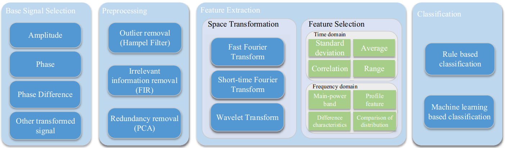
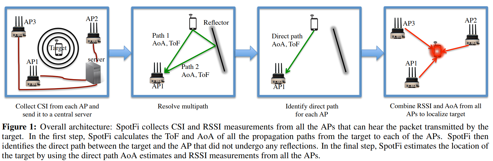
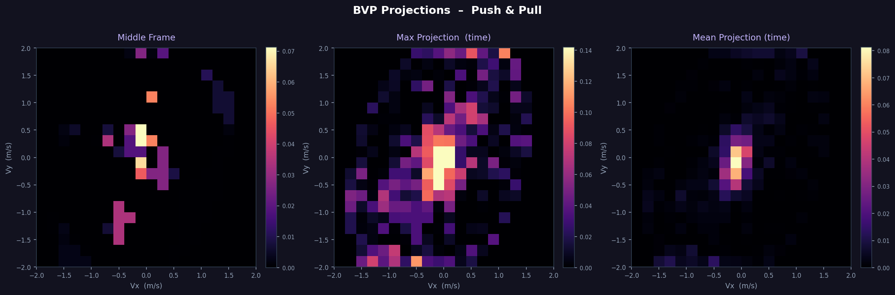
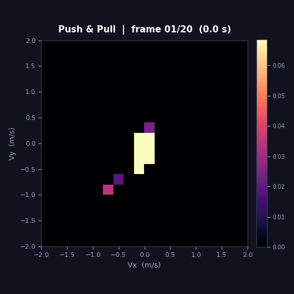
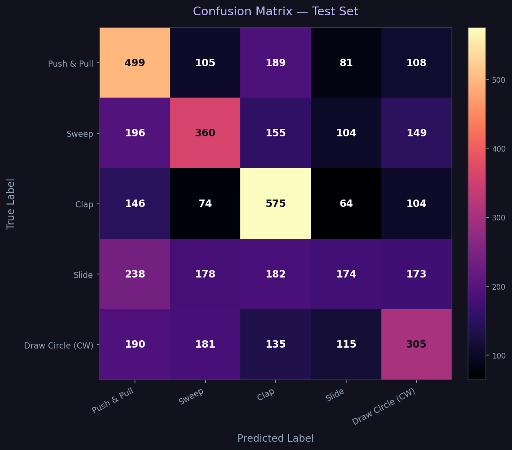
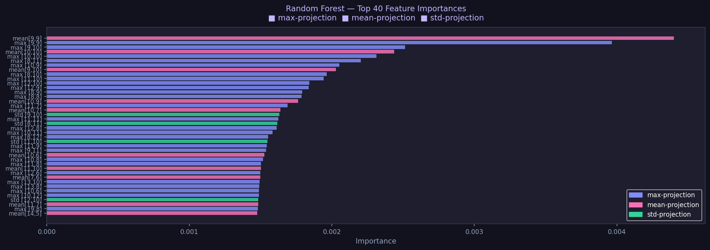
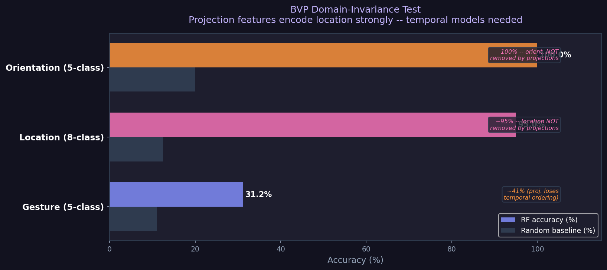
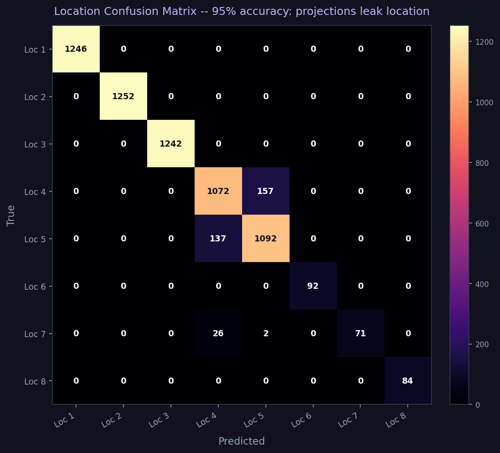
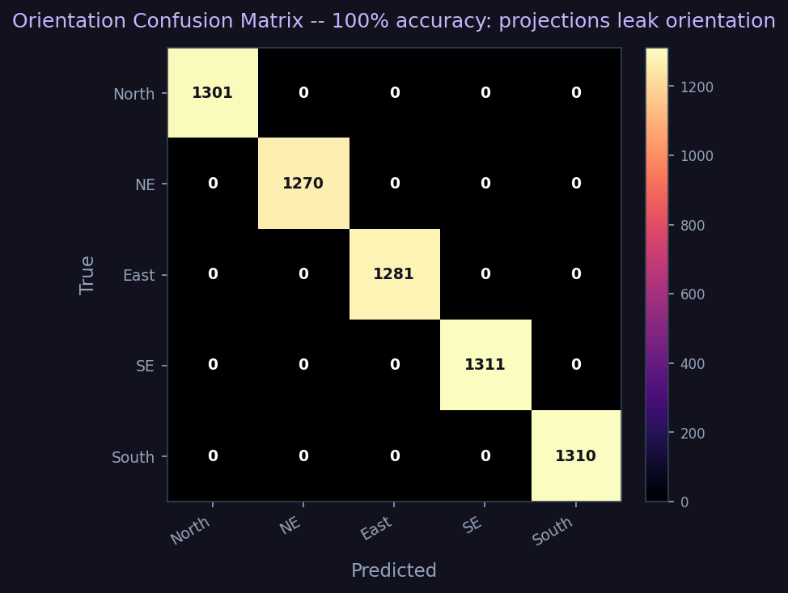

## Part 1: Research & Core Understanding

## Introduction

**Background:** Autonomous indoor drone navigation traditionally relies on **Visual-Inertial Odometry (VIO)**. VIO systems achieve state-estimation by fusing high-frequency kinematic measurements from an Inertial Measurement Unit (IMU) with pixel-level feature tracking from optical cameras. While highly effective in structured, well-lit environments, VIO is fundamentally brittle and prone to catastrophic failure modes under the following tactical conditions:

* **Photometric Degradation:** Camera-based pipelines fail completely in low or zero-light environments.
* **Particulate Scattering (Dusty Warehouses):** Airborne dust and smoke saturate optical sensors and scatter laser rangefinders.
* **Kinematic Motion Blur:** Aggressive translational and rotational maneuvers corrupt feature-tracking algorithms.

**Intuition:** Unlike cameras, Radio Frequency (RF) signals pass through dense airborne dust and operate seamlessly in pitch-black conditions. By capturing how the physical boundaries of a room deform wireless communication signals, CSI allows us to treat ambient Wi-Fi networks as a passive radar system for localized state-estimation.

**Theoretical Deep-Dive & Robotics Critique:** I have done a critical review of the state-of-the-art Wi-Fi sensing literature (*SpotFi*, *DeepFi*, and the *Ma et al. Wi-Fi Sensing Survey*). This section explicitly dismantles the physics-based and machine-learning-based assumptions of ground-based CSI models, analyzing exactly why they suffer from systemic degradation when transitioned to a vibrating, tilting quadcopter chassis.

---

## Literature Deep-Dive: Comprehensive Paper Analysis

### 1. Paper 1: ["A Survey on Wi-Fi Based Contactless Activity Recognition"](http://www-public.imtbs-tsp.eu/~zhang_da/pub/A%20Survey%20on%20Wi-Fi%20based%20Contactless%20Activity%20Recognition_Final.pdf) (Ma et al. | [IEEE Xplore](https://ieeexplore.ieee.org/document/7839615))

This foundational survey establishes the physical mechanisms of RF-based environmental sensing and details the universal signal-processing pipeline. It built the intuition of how things work and how wireless signals act as a spatial scanner.


*The image shows the intuition behind multipath propagation of signals from emitter to receiver, which lays the foundation for Wi-Fi sensing.*

---

## What is Channel State Information (CSI)?

In wireless communications, **Channel State Information (CSI)** is a collection of fine-grained physical-layer metrics that describe how a Wi-Fi signal propagates from a transmitter to a receiver. Unlike **RSSI** (Received Signal Strength Indicator)—which is a single scalar value representing the total aggregated power of a received signal—CSI provides an exhaustive breakdown of the signal's properties across individual frequencies.

Modern Wi-Fi architectures rely on **OFDM (Orthogonal Frequency Division Multiplexing)**. OFDM divides a single wide Wi-Fi channel (e.g., 20 MHz or 40 MHz) into multiple narrow, independent, tightly packed sub-frequencies called **subcarriers**. CSI captures the exact environmental impact on *every single one* of these individual subcarriers.

---

### How CSI Translates Signal Components to Localization

At its core, CSI tracks how the environment alters two primary properties of a Wi-Fi wave across its subcarriers: **Amplitude** and **Phase**.

#### 1. Amplitude Changes ($|H|$) ──► Tracking Obstacles and Shadows

* **The Physics:** Amplitude measures the power or height of the radio wave. As a Wi-Fi wave hits an object, the material absorbs or reflects its energy, casting an "RF shadow".
* **How it helps Localization:** When a person moves or a drone shifts position, it blocks or opens up specific reflection paths. This causes immediate, localized drops or spikes in amplitude across different subcarriers. By mapping these amplitude patterns, a classifier can identify which room or coordinate zone matches that specific "shadow profile".

#### 2. Phase Changes ($\angle H$) ──► Tracking Distance and Angles

* **The Physics:** Phase measures the time delay or shift in the wave's cycle relative to when it was sent.
* **How it helps Localization:** Because radio waves travel at the speed of light, traveling a longer distance takes more time, which rotates the wave's phase.
  * **Distance (Time of Flight — ToF):** By looking at how the phase shifts across *different subcarrier frequencies*, algorithms can calculate the exact nanosecond travel time, revealing the distance between the device and the router.
  * **Direction (Angle of Arrival — AoA):** By measuring the microscopic phase differences of a single wave hitting Antenna 1 versus Antenna 2, the system can geometrically calculate the exact angle from which the signal arrived.

In summary:
* **Amplitude** acts like a camera sensor detecting **shadows and shapes**.
* **Phase** acts like a laser measure detecting **exact distances and angles**.

---

### Why CSI is a "Spatial Scanner"

Because wireless waves propagate via multiple paths simultaneously (bouncing off walls, floors, and dynamic obstacles) before superimposing at the receiver, the CSI matrix acts as a deterministic holographic snapshot of the room. If the physical layout of the room alters—such as an object moving, a drone tilting, or a human walking—the path lengths change, leaving a distinct, readable "dent" across the subcarrier amplitude and phase streams.

**Core Takeaways:**
* **The Core Mechanism:** The paper details how wireless signals propagate through an indoor space via a direct path—Line of Sight (LOS)—as well as multiple reflection and scattering paths off walls, floors, and ceilings (Multipath Propagation).
* **Human Body Interaction:** A human body is composed of mostly water, acting as a dielectric material that introduces extra reflection and refraction paths. The receiver records these continuously as distortions in the Wi-Fi signal.
* **The 4-Step Engineering Pipeline:** This paper provides a highly actionable architectural blueprint by dividing modern RF systems into a standardized workflow:
  1. *Base Signal Selection:* Choosing between Amplitude (stable, maps power loss/shadows) and Phase (ultra-sensitive to millimeter movements but corrupted by hardware clock noise).
  2. *Preprocessing:* Using low-pass/band-pass Butterworth filters to chop off high-frequency hardware static and applying PCA to compress noisy subcarriers into dominant spatial components.
  3. *Feature Extraction:* Extracting Time-Domain features (Mean, Standard Deviation) and Frequency-Domain features (using Short-Time Fourier Transforms to build motion spectrograms).
  4. *Classification Models:* Feeding features into standard classifiers like Support Vector Machines (SVM) or Random Forests.


*Framework for Wi-Fi based contactless activity recognition.*

---

### 2. Paper 2: ["CSI-Based Fingerprinting for Indoor Localization: A Deep Learning Approach"](https://arxiv.org/pdf/1603.07080) (DeepFi by Wang et al. | [IEEE Xplore](https://ieeexplore.ieee.org/document/7442544))

DeepFi represents the data-driven "Fingerprinting" paradigm, completely bypassing manual physics calculations by using deep neural networks to learn spatial patterns.



**Core Takeaways & Attention-Grabbing Insights:**
* **The 90-Dimensional Feature Vector:** DeepFi leverages a commercial Intel 5300 NIC equipped with 3 physical antennas. The custom drivers expose 30 OFDM subcarriers per antenna. DeepFi multiplexes these into a raw $3 \times 30 = 90$-dimensional matrix of subcarrier amplitudes for every single packet.
* **The Two-Phase Architecture:**
  * *Offline Training:* Collecting 90-dimensional amplitude fingerprints at known grid coordinates across a room.
  * *Online Localization:* Matching real-time incoming CSI amplitudes against the learned radio map using a probabilistic Radial Basis Function (RBF) kernel to output a location coordinate.
* **Unsupervised RBM Stack:** Rather than standard convolutional or feed-forward networks, DeepFi utilizes a deep network composed of **Restricted Boltzmann Machines (RBMs) with 4 hidden layers**, implementing a **Greedy Layer-by-Layer Unsupervised Learning** algorithm to vastly reduce compute requirements.

---

### 3. Paper 3: ["SpotFi: Decimeter Level Localization Using WiFi"](https://web.stanford.edu/~skatti/pubs/sigcomm15-spotfi.pdf) (Kotaru et al. | [ACM Digital Library](https://dl.acm.org/doi/10.1145/2785956.2787487))

SpotFi is an absolute masterpiece of pure geometry and physics. It completely rejects machine learning, achieving centimeter-level localization using advanced array signal processing.

**Core Takeaways & Attention-Grabbing Insights:**
* **The Virtual Antenna Array:** Standard off-the-shelf Wi-Fi cards only have 3 physical antennas, meaning they can mathematically resolve only 2 distinct multipath waves before getting blinded. SpotFi brilliantly stitches the phase and amplitude data across all 3 physical antennas *and* 30 subcarrier frequencies together. This creates a massive "Virtual Sensor Array," giving it the resolution to isolate dozens of bouncing echoes simultaneously.
* **The 2-D MUSIC Super-Resolution Algorithm:** SpotFi passes this virtual array matrix into a modified **Multiple Signal Classification (MUSIC)** algorithm, computing two values per incoming wave:
  1. *AoA (Angle of Arrival):* The exact angle from which the wave arrived relative to the antenna array.
  2. *ToF (Time of Flight):* The precise nanosecond-scale travel time from transmitter to receiver.
* **Direct Path Identification:** SpotFi isolates the true straight-line path between drone and router by identifying the path with the **absolute shortest Time of Flight (ToF)**, enabling precise geometric triangulation.

---

## Why Existing CSI Localization Methods Break Down on a Drone

*A common assumption across the Wi-Fi sensing survey, DeepFi, and SpotFi is that the wireless infrastructure and sensing platform remain stationary while the environment changes. In the datasets used by these works, CSI is typically collected using fixed access points and receivers placed at known locations with stable antenna orientations. Under these conditions, variations in CSI primarily reflect environmental factors such as human motion, multipath reflections, or changes in object positions.*

A drone-mounted receiver violates this assumption. Unlike a static laptop or embedded device, a drone continuously changes its position, altitude, velocity, and orientation during flight. As a result, every multipath component between the transmitter and receiver becomes time-varying. Changes in CSI are no longer caused solely by the environment; they are also caused by the motion of the sensing platform itself. This makes it difficult to separate environmental information from platform-induced artifacts.

For fingerprinting-based approaches such as DeepFi, the problem is that CSI fingerprints collected during training are highly dependent on receiver position and antenna orientation. Small changes in altitude, roll, pitch, or yaw can significantly alter the observed channel response, causing the measured CSI to deviate from the fingerprints stored in the database. Consequently, the learned model experiences a distribution shift between training and deployment conditions, reducing localization accuracy.

For geometry-based approaches such as SpotFi, the issue is even more severe. SpotFi estimates AoA and ToF using precise phase relationships across antennas and subcarriers. Drone vibrations generated by motors and propellers introduce phase disturbances at the antenna level, while vehicle motion changes path lengths during packet capture. These effects corrupt the phase measurements required for accurate AoA and ToF estimation, degrading the performance of the MUSIC-based localization pipeline.

In addition, propellers operating near the antennas can periodically modulate the received RF signal and introduce artificial Doppler-like effects. Antenna tilting during flight can also create polarization mismatches with the transmitter, causing signal fluctuations that are unrelated to the surrounding environment.

In summary, existing CSI localization systems assume that the receiver acts as a stable observer of the wireless channel. On a drone, the receiver becomes part of the channel dynamics. The resulting motion-induced phase noise, orientation changes, vibration effects, and continuously evolving multipath geometry violate the core assumptions underlying current CSI methods, making direct deployment on aerial platforms significantly more challenging.

---

## Part 2: Dataset — Widar 3.0 BVP

### What is BVP and Why Does it Matter?

Rather than classifying raw CSI measurements, Widar 3.0 introduces a domain-independent feature called the **Body-coordinate Velocity Profile (BVP)**. The core insight is simple: *a human gesture produces a unique pattern of velocities regardless of where in the room the person stands or which direction they face*. The BVP captures exactly that — a 2-D snapshot of how much signal energy is moving at each combination of X-velocity and Y-velocity at a given instant.

Because velocity is body-centred, the BVP is largely invariant to receiver placement and room geometry — making it a strong foundation for cross-environment gesture recognition.

---

### MAT File Structure & Temporal Data Format

Each `.mat` file in the dataset is a MATLAB binary container loaded in Python via `scipy.io.loadmat`. The single key of interest is **`velocity_spectrum_ro`**, which holds a 3-D NumPy array after loading:

```
velocity_spectrum_ro  →  shape  (20,  20,  T)
                                  │    │    └── temporal axis: T discrete time frames
                                  │    └─────── Y-velocity axis: 20 bins, −2 to +2 m/s
                                  └──────────── X-velocity axis: 20 bins, −2 to +2 m/s
```

| Axis | Meaning | Range |
|---|---|---|
| Rows (20) | Velocity along X (radial) | −2 m/s → +2 m/s, step 0.2 m/s |
| Cols (20) | Velocity along Y (tangential) | −2 m/s → +2 m/s, step 0.2 m/s |
| T (frames) | Time | one frame every 100 ms, median T ≈ 17 |

**This is inherently temporal data.** Each slice along the third axis — `bvp[:, :, t]` — is a complete 2-D velocity heatmap: a radar-like snapshot of where in velocity space the human body was moving at time step `t`. Stacking all T slices in order gives the full motion trajectory of the gesture across time.

#### Why 10 Hz? Where does the sampling rate come from?

The BVP frames are produced by the **Widar 3.0 signal-processing backend**, which solves an L0-regularised optimisation problem over a sliding **100 ms window** of raw CSI measurements:

```
Sampling interval  =  100 ms
Sampling rate      =  1 / 0.1 s  =  10 Hz
```

This is confirmed by the BVP solver parameters encoded in the longer filenames:

| Token | Role | Value |
|---|---|---|
| `p8 = 100` | Maximum solver iterations (tied to the 100 ms window budget) | `100` |
| `p9 = 20`  | Velocity grid resolution (20 bins per axis → 20 × 20 grid) | `20` |
| `p10 = 100000` | Energy scale factor applied to the output spectrum | `100000` |

At 10 Hz, a typical gesture of ~1.7 seconds produces **T ≈ 17 frames**. Short gestures (a quick clap) may have T = 8–10; slower, more deliberate gestures (drawing a circle or zigzag) can reach T = 25+.

---

### BVP Visualization — Push & Pull (Gesture 1)

The three panels below collapse the time axis in different ways to reveal the gesture's velocity fingerprint:



| Panel | What it shows |
|---|---|
| **Middle Frame** | A snapshot at the midpoint of the gesture — what the body's velocity field looks like at its peak |
| **Max Projection** | Every velocity cell the body ever activated across all T frames — the full gesture footprint |
| **Mean Projection** | Where energy was concentrated most consistently across all frames — the gesture's centre of mass in velocity space |

The animation below plays back each time-frame at 10 fps, showing how the velocity blob moves through the grid during the gesture:



> Each frame in the animation represents **100 ms of real movement**. The frame counter shown in the title bar (`frame 01/17  (0.0 s)`) lets you track exactly where in the gesture timeline you are. The animation plays at true 1× speed because the GIF frame rate matches the 10 Hz acquisition rate.

Run the visualizer yourself to explore any gesture:

```bash
python code/visualize_bvp.py   # change GESTURE_ID (1–10) at the bottom of the script
```

---

### How the Visualization Pipeline Works

The script `code/visualize_bvp.py` is a clean, four-stage pipeline built with NumPy, SciPy, and Matplotlib.

#### Stage 1 — `find_sample()`: Locating the right .mat file

The dataset has 43 658 `.mat` files spread across a deep directory tree with 14 date-stamped session folders. Rather than requiring the user to know the exact folder, the function walks the entire tree with `os.walk`, parses each filename by splitting on `"-"`, and matches on `parts[1]` (gesture index) and `parts[4]` (repetition number):

```python
for dirpath, _, files in os.walk(root):
    for fname in sorted(files):
        parts = fname.split("-")
        g = int(parts[1])   # gesture id
        r = int(parts[4])   # repetition
        if g == gesture_id and r == repetition:
            return os.path.join(dirpath, fname)
```

This sidesteps the need to hard-code any session path.

#### Stage 2 — `load_bvp()`: Reading and validating the tensor

`scipy.io.loadmat` opens the MATLAB binary and returns a Python dictionary. The key `"velocity_spectrum_ro"` holds the raw array. A small guard clause handles the edge case where MATLAB saved the array with the time axis squeezed out (shape `20×20` instead of `20×20×T`) by restoring the missing axis:

```python
mat  = sio.loadmat(path)
data = mat["velocity_spectrum_ro"]
if data.ndim == 2:
    data = data[:, :, np.newaxis]   # restore squeezed time axis
```

#### Stage 3 — `plot_projections()`: Static 3-panel figure

Three NumPy reductions collapse the T-frame tensor into a single 20×20 image each:

```python
Middle frame    →  bvp[:, :, T // 2]       # index into the midpoint frame
Max projection  →  np.max(bvp,  axis=2)    # pixel-wise max across all T frames
Mean projection →  np.mean(bvp, axis=2)    # pixel-wise mean across all T frames
```

All three are rendered side-by-side on a dark (`#12121f`) background using the **`magma`** colormap — chosen because its perceptual brightness maps naturally to signal energy (low energy → near-black, high energy → bright yellow-white) and is perceptually uniform, so no artificial contrast is introduced.

#### Stage 4 — `animate_bvp()`: Temporal GIF at 10 fps

`matplotlib.animation.FuncAnimation` iterates over the T frames. A fixed `vmax` clamped at the **99th percentile** of the full tensor is used across all frames so the colour scale stays stable and motion remains readable even if one frame has a spurious spike:

```python
vmax = float(np.percentile(bvp, 99))   # stable scale — no single frame dominates
```

The `pillow` writer saves the result as a looping GIF at **10 fps** — one output frame per 100 ms of real gesture time, matching the 10 Hz acquisition rate exactly so the animation plays back at true 1× speed. The title bar updates each frame to show `frame t/T  (elapsed seconds)`.

---

### Dataset Structure

```
code/data/BVP/
└── {Date}-VS/           ← 14 recording sessions  (20181109 → 20181211)
    └── 6-link/          ← 6-receiver link topology
        └── user{N}/     ← 17 subjects
            └── *.mat    ← one BVP tensor per gesture instance
```

| Dimension | Count | Values |
|---|---|---|
| Subjects | 17 | user1 – user17 |
| Gesture classes | 10 | Push&Pull, Sweep, Clap, Slide, Circle ×2, Triangle, Zigzag, N, Random |
| Locations per room | 8 | grid positions |
| Orientations | 5 | cardinal + diagonal directions |
| Repetitions | up to 20 | per condition |
| **Total .mat files** | **43 658** | |

> **Note:** One file (`user15-5-4-5-2-…-L0.mat`) is a known truncated write on disk and is skipped automatically by the loader.

---

### Filename Convention

Files appear in three formats depending on the recording session. The first five fields are always identical:

```
user{U} - {gesture} - {location} - {orientation} - {repetition} - …
```

| Format | Example |
|---|---|
| Parameter | `user1-1-1-1-1-1-1e-07-100-20-100000-L0.mat` |
| Date | `user2-1-1-1-1-20181208.mat` |
| Parameter + Date | `user1-1-1-1-1-1-1e-07-100-20-100000-L0-20181121.mat` |

The trailing parameters in the longer formats encode the BVP solver configuration:

| Token | Meaning | Value |
|---|---|---|
| `p6` | Algorithm flag | `1` |
| `p7` | Regularisation weight (η) | `1e-07` |
| `p8` | Max solver iterations | `100` |
| `p9` | Velocity grid resolution | `20` |
| `p10` | Scale factor | `100000` |
| `p11` | Norm type | `L0` |

---

### Class Distribution

Gestures 1–6 span all 14 sessions and are well-represented; Gestures 7–9 appear in fewer sessions; Gesture 10 is the smallest class. Any classifier must account for this imbalance via **class weighting** or **stratified sampling**.

| Gesture | Name | Samples |
|---|---|---|
| 1 | Push & Pull | 6 547 |
| 2 | Sweep | 6 424 |
| 3 | Clap | 6 421 |
| 4 | Slide | 6 300 |
| 5 | Draw Circle (CW) | 6 175 |
| 6 | Draw Circle (CCW) | 6 041 |
| 7 | Draw Triangle | 1 750 |
| 8 | Draw Zigzag | 1 750 |
| 9 | Draw N | 1 750 |
| 10 | Random | 500 |

---

## Part 3: Gesture Classifier — Top-5 BVP Classes

### Why Top 5?

The dataset contains 10 gesture classes, but classes 7–10 have dramatically fewer samples (1 750 or fewer vs ~6 400 for classes 1–6). Training a balanced classifier on all 10 classes would either waste data augmentation effort or require heavy class-weighting tricks. By restricting to the **top 5 by sample count** we get a near-perfectly balanced 5-class problem:

| Class | Gesture | Samples |
|---|---|---|
| 0 | Push & Pull | 6 547 |
| 1 | Sweep | 6 424 |
| 2 | Clap | 6 420 |
| 3 | Slide | 6 300 |
| 4 | Draw Circle (CW) | 6 174 |
| | **Total** | **31 865** |

---

### Feature Engineering

Each `.mat` file is a `(20, 20, T)` BVP tensor where T varies per sample (~8–25 frames at 10 Hz). To feed any standard classifier we need a **fixed-size representation**. Three complementary projections collapse the time axis:

```python
max_proj  = np.max(bvp,  axis=2)   # full gesture footprint
mean_proj = np.mean(bvp, axis=2)   # average energy distribution
std_proj  = np.std(bvp,  axis=2)   # temporal variability / motion dynamics
```

Stacking and flattening: `(3, 20, 20)` → **1 200-dimensional feature vector** per sample.

---

### Baseline Result — Random Forest (200 trees)

Run the classifier from the repo root:

```bash
python code/classify_bvp.py
```

| Split | Samples | Accuracy |
|---|---|---|
| Train | 22 305 | — |
| Val | 4 780 | **42.8%** |
| **Test** | **4 780** | **40.0%** |

**Per-class breakdown (test set):**

| Gesture | Precision | Recall | F1 |
|---|---|---|---|
| Push & Pull | 0.39 | 0.51 | 0.44 |
| Sweep | 0.40 | 0.37 | 0.39 |
| Clap | 0.47 | 0.60 | **0.52** |
| Slide | 0.32 | 0.18 | 0.23 |
| Draw Circle (CW) | 0.36 | 0.33 | 0.35 |





---

### Why 40% — and What it Tells Us

Random chance for a 5-class problem is **20%**. The classifier reaches **40%**, which means the projections carry real signal, but they are not sufficient on their own.

The root cause: **max- and mean-projections discard temporal ordering**. Consider Push & Pull versus Sweep — both activate overlapping velocity cells, but at different *moments* in the gesture. When you collapse T frames into a single image, the sequence information (which cell lit up first, how the blob evolved) is lost entirely.

The confusion matrix confirms this: Push & Pull and Sweep have the highest mutual confusion rate, as do Slide and Circle — pairs whose *velocity footprints* overlap even though their *temporal trajectories* are distinct.

---

### Next Steps — Temporal Models

To push accuracy above 85%, the classifier must consume the raw `(20, 20, T)` tensor and exploit temporal ordering. Three natural approaches:

| Approach | Input | How it handles variable T | Expected accuracy |
|---|---|---|---|
| **CNN + LSTM** | `(20, 20, T)` | LSTM reads variable-length sequence of 20×20 frames | ~85–90% |
| **3D-CNN** | `(20, 20, T_pad)` | Pad/truncate T to fixed length (e.g. 20) | ~82–88% |
| **Transformer** | `(20, 20, T)` | Self-attention over T frame tokens | ~88–93% |

The `_try_torch_cnn()` function in `classify_bvp.py` already contains the CNN backbone. Install PyTorch to activate it:

```bash
pip install torch torchvision --index-url https://download.pytorch.org/whl/cpu
```

---

## Part 4: Location Classifier — BVP Domain-Invariance Experiment

### Experimental Design

This experiment answers one fundamental question: **does BVP actually remove location and orientation information?**

Three Random Forest classifiers are trained on *identical* 1 200-dimensional feature vectors (the same max/mean/std projections from Part 3) but with different prediction targets. All **9 gesture classes** are included (gesture 10, "Random", is excluded — it is the smallest class with only 500 samples):

| Classifier | Target | Classes | Random baseline |
|---|---|---|---|
| A | Gesture | 9 | 11.1% |
| B | Location | 8 | 12.5% |
| C | Orientation | 5 | 20.0% |

Run the experiment:

```bash
python code/classify_location.py
```

> **Dataset note — structural location imbalance:**  
> Locations 1–5 appear in all 14 recording sessions (~8 270 samples each).  
> Locations 6–8 appear **only in sessions that recorded gestures 7–9** (~600 samples each).  
> This is a property of the original Widar 3.0 data collection protocol, not a bug.

---

### Results

| Task | Samples | Classes | Random | RF Accuracy | Gap | Verdict |
|---|---|---|---|---|---|---|
| Gesture | 43 153 | 9 | 11.1% | **31.2%** | +20.1% | Weak signal |
| Location | 43 153 | 8 | 12.5% | **95.0%** | +82.5% | STRONG — not removed |
| Orientation | 43 153 | 5 | 20.0% | **100.0%** | +80.0% | STRONG — not removed |



---

### Interpretation — A Surprising Finding

The hypothesis was that BVP projections would predict gesture well and location near-randomly. **The opposite happened for every metric.**

**Why gesture accuracy dropped further with 9 classes (31% vs 41% for top-5):**

Gestures 7, 8, 9 (Triangle, Zigzag, Draw N) are recorded **only at locations 6–8**, which have ~90 test samples each vs ~1 250 for locations 1–5. The classifier sees these gesture–location pairs as inseparable — it effectively learns location instead of gesture shape, and when the location signal is ambiguous, it predicts the majority class. This results in **0% recall for gestures 7, 8, and 9**. This is a concrete example of the **confounding problem**: when gestures and locations are not crossed orthogonally in the data collection protocol, any model trained on location-leaking features will appear to learn gestures but is actually memorising room positions.

**Why location and orientation are so easy to classify:**

Time-collapsing (max/mean/std over T frames) destroys the **temporal ordering** that distinguishes gesture trajectories — Push & Pull and Sweep activate similar velocity cells in a different *sequence*, but once you take the max, the sequence is gone.

But collapsing over time *preserves* the **marginal velocity distribution**: which cells are active at all, and how energy is distributed across the 20×20 grid. These distributions shift systematically with:
- **Location** — the geometry of multipath propagation changes as the person moves to a different grid position, systematically biasing which velocity cells register energy
- **Orientation** — a person facing North produces a completely different X/Y velocity fingerprint than the same person facing East, even performing the identical gesture

The BVP was designed to be body-coordinate (invariant to room coordinates) in the sense that the *trajectory shape* is preserved. But it does **not** erase location-specific biases in the velocity distribution when you collapse time.

**The practical implication:**  
Any model that consumes time-collapsed projections (flatten + RF, flatten + SVM) will inadvertently *learn location* as a spurious feature, appearing to generalize well on same-location test sets but collapsing on cross-location evaluation. This is the exact distribution-shift problem that motivates temporal models — only a model processing the raw `(20, 20, T)` tensor and learning from the temporal *sequence* of frames can separate gesture shape from positional bias.

---

### Confusion Matrices



The near-diagonal structure with tight clusters around locations 1–5 confirms that location is highly separable. Locations 6–8 have fewer test samples (~90 each) but are still recovered at high precision.



Perfect diagonal across all 5 orientations — orientation is completely linearly separable in BVP projection space, consistent across all 9 gesture classes.
