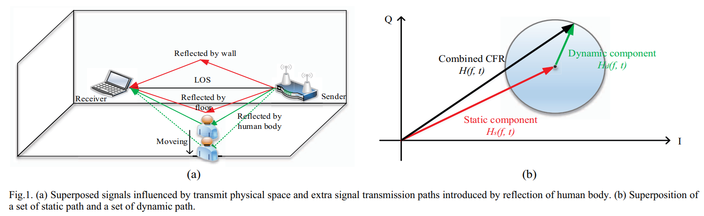
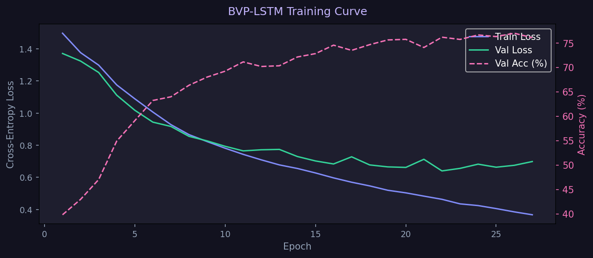
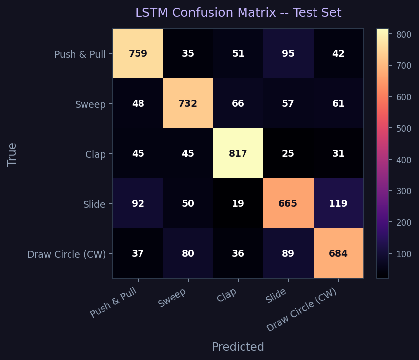

## Part 1: Research and Core Understanding

## Introduction

**Background:** Autonomous indoor drone navigation traditionally relies on **Visual Inertial Odometry (VIO)**. VIO systems achieve state estimation by fusing high frequency kinematic measurements from an Inertial Measurement Unit (IMU) with pixel level feature tracking from optical cameras. While highly effective in structured, well lit environments, VIO is fundamentally brittle and prone to catastrophic failure modes under the following tactical conditions:

* **Photometric Degradation:** Camera based pipelines fail completely in low or zero light environments.
* **Particulate Scattering (Dusty Warehouses):** Airborne dust and smoke saturate optical sensors and scatter laser rangefinders.
* **Kinematic Motion Blur:** Aggressive translational and rotational maneuvers corrupt feature tracking algorithms.

**Intuition:** Unlike cameras, Radio Frequency (RF) signals pass through dense airborne dust and operate seamlessly in pitch black conditions. By capturing how the physical boundaries of a room deform wireless communication signals, CSI allows us to treat ambient Wi-Fi networks as a passive radar system for localized state estimation.

**Theoretical Deep Dive and Robotics Critique:** I have done a critical review of the state of the art Wi-Fi sensing literature (*SpotFi*, *DeepFi*, and the *Ma et al. Wi-Fi Sensing Survey*). This section explicitly dismantles the physics based and machine learning based assumptions of ground based CSI models, analyzing exactly why they suffer from systemic degradation when transitioned to a vibrating, tilting quadcopter chassis.

***

## Literature Deep Dive: Comprehensive Paper Analysis

### 1. Paper 1: ["A Survey on Wi-Fi Based Contactless Activity Recognition"](http://www-public.imtbs-tsp.eu/~zhang_da/pub/A%20Survey%20on%20Wi-Fi%20based%20Contactless%20Activity%20Recognition_Final.pdf) (Ma et al. | [IEEE Xplore](https://ieeexplore.ieee.org/document/7839615))

This foundational survey establishes the physical mechanisms of RF based environmental sensing and details the universal signal processing pipeline. It built the intuition of how things work and how wireless signals act as a spatial scanner.



*The image shows the intuition behind multipath propagation of signals from emitter to receiver, which lays the foundation for Wi-Fi sensing.*

***

## What is Channel State Information (CSI)?

In wireless communications, **Channel State Information (CSI)** is a collection of fine grained physical layer metrics that describe how a Wi-Fi signal propagates from a transmitter to a receiver. Unlike **RSSI** (Received Signal Strength Indicator) which is a single scalar value representing the total aggregated power of a received signal CSI provides an exhaustive breakdown of the signal's properties across individual frequencies.

Modern Wi-Fi architectures rely on **OFDM (Orthogonal Frequency Division Multiplexing)**. OFDM divides a single wide Wi-Fi channel (such as 20 MHz or 40 MHz) into multiple narrow, independent, tightly packed sub frequencies called **subcarriers**. CSI captures the exact environmental impact on every single one of these individual subcarriers.

***

### How CSI Translates Signal Components to Localization

At its core, CSI tracks how the environment alters two primary properties of a Wi-Fi wave across its subcarriers: **Amplitude** and **Phase**.

#### 1. Amplitude Changes ($|H|$) for Tracking Obstacles and Shadows

* **The Physics:** Amplitude measures the power or height of the radio wave. As a Wi-Fi wave hits an object, the material absorbs or reflects its energy, casting an "RF shadow".
* **How it helps Localization:** When a person moves or a drone shifts position, it blocks or opens up specific reflection paths. This causes immediate, localized drops or spikes in amplitude across different subcarriers. By mapping these amplitude patterns, a classifier can identify which room or coordinate zone matches that specific "shadow profile".

#### 2. Phase Changes ($\angle H$) for Tracking Distance and Angles

* **The Physics:** Phase measures the time delay or shift in the wave's cycle relative to when it was sent.
* **How it helps Localization:** Because radio waves travel at the speed of light, traveling a longer distance takes more time, which rotates the wave's phase.
  * **Distance (Time of Flight (ToF)):** By looking at how the phase shifts across different subcarrier frequencies, algorithms can calculate the exact nanosecond travel time, revealing the distance between the device and the router.
  * **Direction (Angle of Arrival (AoA)):** By measuring the microscopic phase differences of a single wave hitting Antenna 1 versus Antenna 2, the system can geometrically calculate the exact angle from which the signal arrived.

In summary:
* **Amplitude** acts like a camera sensor detecting **shadows and shapes**.
* **Phase** acts like a laser measure detecting **exact distances and angles**.

***

### Why CSI is a "Spatial Scanner"

Because wireless waves propagate via multiple paths simultaneously (bouncing off walls, floors, and dynamic obstacles) before superimposing at the receiver, the CSI matrix acts as a deterministic holographic snapshot of the room. If the physical layout of the room alters (such as an object moving, a drone tilting, or a human walking) the path lengths change, leaving a distinct, readable "dent" across the subcarrier amplitude and phase streams.

**Core Takeaways:**
* **The Core Mechanism:** The paper details how wireless signals propagate through an indoor space via a direct path (Line of Sight (LOS)) as well as multiple reflection and scattering paths off walls, floors, and ceilings (Multipath Propagation).
* **Human Body Interaction:** A human body is composed of mostly water, acting as a dielectric material that introduces extra reflection and refraction paths. The receiver records these continuously as distortions in the Wi-Fi signal.
* **The 4 Step Engineering Pipeline:** This paper provides a highly actionable architectural blueprint by dividing modern RF systems into a standardized workflow:
  1. *Base Signal Selection:* Choosing between Amplitude (stable, maps power loss/shadows) and Phase (ultra sensitive to millimeter movements but corrupted by hardware clock noise).
  2. *Preprocessing:* Using low pass/band pass Butterworth filters to chop off high frequency hardware static and applying PCA to compress noisy subcarriers into dominant spatial components.
  3. *Feature Extraction:* Extracting Time Domain features (Mean, Standard Deviation) and Frequency Domain features (using Short Time Fourier Transforms to build motion spectrograms).
  4. *Classification Models:* Feeding features into standard classifiers like Support Vector Machines (SVM) or Random Forests.


*Framework for Wi-Fi based contactless activity recognition.*

***

### 2. Paper 2: ["CSI-Based Fingerprinting for Indoor Localization: A Deep Learning Approach"](https://arxiv.org/pdf/1603.07080) (DeepFi by Wang et al. | [IEEE Xplore](https://ieeexplore.ieee.org/document/7442544))

DeepFi represents the data driven "Fingerprinting" paradigm, completely bypassing manual physics calculations by using deep neural networks to learn spatial patterns.


**Core Takeaways and Attention Grabbing Insights:**
* **The 90 Dimensional Feature Vector:** DeepFi leverages a commercial Intel 5300 NIC equipped with 3 physical antennas. The custom drivers expose 30 OFDM subcarriers per antenna. DeepFi multiplexes these into a raw 3 by 30 (90 dimensional) matrix of subcarrier amplitudes for every single packet.
* **The Two Phase Architecture:**
  * *Offline Training:* Collecting 90 dimensional amplitude fingerprints at known grid coordinates across a room.
  * *Online Localization:* Matching real time incoming CSI amplitudes against the learned radio map using a probabilistic Radial Basis Function (RBF) kernel to output a location coordinate.
* **Unsupervised RBM Stack:** Rather than standard convolutional or feed forward networks, DeepFi utilizes a deep network composed of **Restricted Boltzmann Machines (RBMs) with 4 hidden layers**, implementing a **Greedy Layer by Layer Unsupervised Learning** algorithm to vastly reduce compute requirements.

***

### 3. Paper 3: ["SpotFi: Decimeter Level Localization Using WiFi"](https://web.stanford.edu/~skatti/pubs/sigcomm15-spotfi.pdf) (Kotaru et al. | [ACM Digital Library](https://dl.acm.org/doi/10.1145/2785956.2787487))

SpotFi is an absolute masterpiece of pure geometry and physics. It completely rejects machine learning, achieving centimeter level localization using advanced array signal processing.

**Core Takeaways and Attention Grabbing Insights:**
* **The Virtual Antenna Array:** Standard off the shelf Wi-Fi cards only have 3 physical antennas, meaning they can mathematically resolve only 2 distinct multipath waves before getting blinded. SpotFi brilliantly stitches the phase and amplitude data across all 3 physical antennas and 30 subcarrier frequencies together. This creates a massive "Virtual Sensor Array," giving it the resolution to isolate dozens of bouncing echoes simultaneously.
* **The 2 D MUSIC Super Resolution Algorithm:** SpotFi passes this virtual array matrix into a modified **Multiple Signal Classification (MUSIC)** algorithm, computing two values per incoming wave:
  1. *AoA (Angle of Arrival):* The exact angle from which the wave arrived relative to the antenna array.
  2. *ToF (Time of Flight):* The precise nanosecond scale travel time from transmitter to receiver.
* **Direct Path Identification:** SpotFi isolates the true straight line path between drone and router by identifying the path with the **absolute shortest Time of Flight (ToF)**, enabling precise geometric triangulation.

***

## Why Existing CSI Localization Methods Break Down on a Drone

*A common assumption across the Wi-Fi sensing survey, DeepFi, and SpotFi is that the wireless infrastructure and sensing platform remain stationary while the environment changes. In the datasets used by these works, CSI is typically collected using fixed access points and receivers placed at known locations with stable antenna orientations. Under these conditions, variations in CSI primarily reflect environmental factors such as human motion, multipath reflections, or changes in object positions.*

A drone mounted receiver violates this assumption. Unlike a static laptop or embedded device, a drone continuously changes its position, altitude, velocity, and orientation during flight. As a result, every multipath component between the transmitter and receiver becomes time varying. Changes in CSI are no longer caused solely by the environment; they are also caused by the motion of the sensing platform itself. This makes it difficult to separate environmental information from platform induced artifacts.

For fingerprinting based approaches such as DeepFi, the problem is that CSI fingerprints collected during training are highly dependent on receiver position and antenna orientation. Small changes in altitude, roll, pitch, or yaw can significantly alter the observed channel response, causing the measured CSI to deviate from the fingerprints stored in the database. Consequently, the learned model experiences a distribution shift between training and deployment conditions, reducing localization accuracy.

For geometry-based approaches such as SpotFi, the issue is even more severe. SpotFi estimates AoA and ToF using precise phase relationships across antennas and subcarriers. Drone vibrations generated by motors and propellers introduce phase disturbances at the antenna level, while vehicle motion changes path lengths during packet capture. These effects corrupt the phase measurements required for accurate AoA and ToF estimation, degrading the performance of the MUSIC-based localization pipeline.

In addition, propellers operating near the antennas can periodically modulate the received RF signal and introduce artificial Doppler like effects. Antenna tilting during flight can also create polarization mismatches with the transmitter, causing signal fluctuations that are unrelated to the surrounding environment.

In summary, existing CSI localization systems assume that the receiver acts as a stable observer of the wireless channel. On a drone, the receiver becomes part of the channel dynamics. The resulting motion induced phase noise, orientation changes, vibration effects, and continuously evolving multipath geometry violate the core assumptions underlying current CSI methods, making direct deployment on aerial platforms significantly more challenging.

***

## Part 2: Dataset Widar 3.0 BVP

### What is BVP and Why Does it Matter?

Rather than classifying raw CSI measurements, Widar 3.0 introduces a domain independent feature called the **Body-coordinate Velocity Profile (BVP)**. The core insight is simple: *a human gesture produces a unique pattern of velocities regardless of where in the room the person stands or which direction they face*. The BVP captures exactly that: a 2-D snapshot of how much signal energy is moving at each combination of X-velocity and Y-velocity at a given instant.

Because velocity is body centered, the BVP is largely invariant to receiver placement and room geometry, making it a strong foundation for cross environment gesture recognition.

***

### MAT File Structure and Temporal Data Format

Each `.mat` file in the dataset is a MATLAB binary container loaded in Python via `scipy.io.loadmat`. The single key of interest is **`velocity_spectrum_ro`**, which holds a 3-D NumPy array after loading:

```
velocity_spectrum_ro  →  shape  (20,  20,  T)
                                  │    │    └── time axis: T Time frames
                                  │    └─────── Y-velocity axis: 20 bins, −2 to +2 m/s
                                  └──────────── X-velocity axis: 20 bins, −2 to +2 m/s
```

| Axis | Meaning | Range |
|---|---|---|
| Rows (20) | Velocity along X (radial) | −2 m/s → +2 m/s, step 0.2 m/s |
| Cols (20) | Velocity along Y (tangential) | −2 m/s → +2 m/s, step 0.2 m/s |
| T (frames) | Time | one frame every 100 ms, median T ≈ 17 |

**This is inherently temporal data.** Each slice along the third axis `bvp[:, :, t]` is a complete 2-D velocity heatmap: a radar-like snapshot of where in velocity space the human body was moving at time step `t`. Stacking all T slices in order gives the full motion trajectory of the gesture across time.

#### Why 10 Hz? Where does the sampling rate come from?

The BVP frames are produced by the **Widar 3.0 signal processing backend**, which solves an L0 regularised optimisation problem over a sliding **100 ms window** of raw CSI measurements:

```
Sampling interval  =  100 ms
Sampling rate      =  1 / 0.1 s  =  10 Hz
```

This is confirmed by the BVP solver parameters encoded in the longer filenames:

| Token | Role | Value |
|---|---|---|
| `p8 = 100` | Maximum solver iterations (tied to the 100 ms window budget) | `100` |
| `p9 = 20`  | Velocity grid resolution (20 bins per axis to 20 by 20 grid) | `20` |
| `p10 = 100000` | Energy scale factor applied to the output spectrum | `100000` |

At 10 Hz, a typical gesture of ~1.7 seconds produces **T ≈ 17 frames**. Short gestures (a quick clap) may have T = 8 to 10; slower, more deliberate gestures (drawing a circle or zigzag) can reach T = 25+.

***

### Filename Convention

Files appear in three formats depending on the recording session. The first five fields are always identical:

```
user{U} - {gesture} - {location} - {orientation} - {repetition} - …
```

| Format | Example |
|---|---|
| Parameter | `user1-1-1-1-1-1-1e-07-100-20-100000-L0.mat` |
| Date | `user2-1-1-1-1-20181208.mat` |
| Parameter + Date | `user1-1-1-1-1-1-1e-07-100-20-100000-L0-20181121.mat` |

The trailing parameters in the longer formats encode the BVP solver configuration:

| Token | Meaning | Value |
|---|---|---|
| `p6` | Algorithm flag | `1` |
| `p7` | Regularisation weight (η) | `1e-07` |
| `p8` | Max solver iterations | `100` |
| `p9` | Velocity grid resolution | `20` |
| `p10` | Scale factor | `100000` |
| `p11` | Norm type | `L0` |

***

### Class Distribution

Gestures 1 to 6 span all 14 sessions and are well represented; Gestures 7 to 9 appear in fewer sessions; Gesture 10 is the smallest class. Any classifier must account for this imbalance via **class weighting** or **stratified sampling**.

| Gesture | Name | Samples |
|---|---|---|
| 1 | Push & Pull | 6 547 |
| 2 | Sweep | 6 424 |
| 3 | Clap | 6 421 |
| 4 | Slide | 6 300 |
| 5 | Draw Circle (CW) | 6 175 |
| 6 | Draw Circle (CCW) | 6 041 |
| 7 | Draw Triangle | 1 750 |
| 8 | Draw Zigzag | 1 750 |
| 9 | Draw N | 1 750 |
| 10 | Random | 500 |

***

### Environmental and Deployment Parameters

| Dimension | Count | Details / Values |
|---|---|---|
| **Subjects** | 17 | `user1` to `user17` |
| **Gesture Classes** | 10 | Push & Pull (1), Sweep (2), Clap (3), Slide (4), Draw Circle CW (5), Draw Circle CCW (6), Draw Triangle (7), Draw Zigzag (8), Draw N (9), Random (10) |
| **Torso Locations** | 8 | Grid positions (m) relative to Tx at (0, 0):<br>1: `(1.365, 0.455)`<br>2: `(0.455, 0.455)`<br>3: `(0.455, 1.365)`<br>4: `(1.365, 1.365)`<br>5: `(0.91, 0.91)`<br>6: `(2.275, 1.365)`<br>7: `(2.275, 2.275)`<br>8: `(1.365, 2.275)` *(Locations 6 to 8 are not shown in diagrams)* |
| **Face Orientations** | 5 | Angle offsets in degrees relative to Tx direction (0°):<br>1: `-90°` (South)<br>2: `-45°` (South East)<br>3: `0°` (East, facing Tx)<br>4: `45°` (North East)<br>5: `90°` (North) |
| **Environments (Rooms)** | 3 | Room 1: Classroom, Room 2: Hall, Room 3: Office |
| **Repetitions** | up to 20 | per condition |
| **Total BVP .mat files** | **43 658** | |

> [!NOTE]
> **Data Integrity Notice:**
> * **BVP data:** One BVP file (`user15-5-4-5-2-...-L0.mat`) has a known truncated write on disk and is automatically skipped by loaders.
> * **CSI raw data:** The official dataset has 7 empty `.dat` files that must be skipped in CSI loading pipelines:
>   * `20181109/user2/user2-6-4-4-2-r1.dat`
>   * `20181109/user3/user3-1-3-1-8-r5.dat`
>   * `20181118/user2/user2-3-5-3-4-r4.dat`
>   * `20181209/user6/user6-3-1-1-5-r5.dat`
>   * `20181211/user8/user8-1-1-1-1-r5.dat`
>   * `20181211/user8/user8-3-3-3-5-r2.dat`
>   * `20181211/user9/user9-1-1-1-1-r1.dat`

***

### Dataset Structure

```
code/data/BVP/
└── {Date}-VS/           ← 14 recording sessions  (20181109 → 20181211)
    └── 6-link/          ← 6-receiver link topology
        └── user{N}/     ← 17 subjects
            └── *.mat    ← one BVP tensor per gesture instance
```

***

### Dataset Modalities and Formats

Widar 3.0 consists of three complementary data modalities:
1. **Channel State Information (CSI)**: Raw physical layer Wi-Fi measurements stored as `id-a-b-c-d-Rx.dat` (where `Rx` indicates receiver ID 1 to 6).
2. **Doppler Frequency Spectrum (DFS)**: Contained in `id-a-b-c-d-suffix.mat`. Each file is a 6 by 121 by T matrix, where the dimensions represent 6 receivers, 121 frequency bins (ranging from $[-60, 60]\text{ Hz}$), and timestamps at 1000 Hz sampling rate.
3. **Body-coordinate Velocity Profile (BVP)**: Contained in `id-a-b-c-d-suffix.mat`. Each file is a 20 by 20 by T matrix representing velocity along X/Y axes $[-2, +2]\text{ m/s}$ (20 bins each) at a 10 Hz sampling rate.

#### BVP and DFS Extraction from Raw CSI (Matlab Reference)

If you need to extract the Doppler spectrum or body velocity profiles from raw physical CSI files, refer to the official MATLAB utility scripts (`BVPExtractionCode.zip` and `DFSExtractionCode.zip`) provided in the Widar 3.0 dataset to run the Doppler Velocity Model (DVM) solver and compute Short Time Fourier Transforms (STFT).

***

### Codebase Structure

The codebase inside the `code/` directory is modularly structured to separate concerns and maximize code reuse:

*   **`code/bvp_loader.py`**: Shared data access layer. Houses configuration constants (gesture mappings, grid locations, orientations), extracts 1200 dimensional temporal projections (max, mean, std), and handles dataset loading and compressed `.npz` caching.
*   **`code/bvp_plotting.py`**: Shared presentation layer. Implements custom dark themed heatmaps (`plot_confusion_matrix`) and bar charts (`plot_invariance_summary`).
*   **`code/classify_bvp.py`**: Script for training and evaluating a Multi Layer Perceptron (MLP) (and optional CNN) classifier on the Top 5 gesture classes. Reuses components from `bvp_loader` and `bvp_plotting`.
*   **`code/classify_location.py`**: Script for evaluating BVP domain invariance. Trains parallel MLP classifiers (Gesture and Location) on BVP projections and plots performance gaps. Reuses components from `bvp_loader` and `bvp_plotting`.
*   **`code/visualize_bvp.py`**: Script for BVP visual exploration. Generates static projections and 10 fps temporal GIF animations for single gesture instances.

***

## Part 3: BVP Visualization and Explorer

### BVP Visualization Push and Pull (Gesture 1)

The three panels below collapse the time axis in different ways to reveal the gesture's velocity fingerprint:


| Panel | What it shows |
|---|---|
| **Middle Frame** | A snapshot at the midpoint of the gesture: what the body's velocity field looks like at its peak |
| **Max Projection** | Every velocity cell the body ever activated across all T frames: the full gesture footprint |
| **Mean Projection** | Where energy was concentrated most consistently across all frames: the gesture's centre of mass in velocity space |

The animation below plays back each time frame at 10 fps, showing how the velocity blob moves through the grid during the gesture:


> Each frame in the animation represents **100 ms of real movement**. The frame counter shown in the title bar (`frame 01/17 (0.0 s)`) lets you track exactly where in the gesture timeline you are. The animation plays at true 1× speed because the GIF frame rate matches the 10 Hz acquisition rate.

Run the visualizer yourself to explore any gesture:

```bash
python code/visualize_bvp.py
```

***

### How the Visualization Pipeline Works

The script `code/visualize_bvp.py` coordinates a clean, four stage pipeline importing its data utilities from the shared `code/bvp_loader.py` module:

1. **Locating the Mat File:** Walks the directory tree dynamically matching the selected gesture ID and repetition to locate the file, avoiding hardcoded paths.
2. **Tensor Loading:** Opens the MATLAB binary using `scipy.io.loadmat`, extracts the velocity spectrum tensor, and validates the dimensional axes (squeezing or expanding dimensions to ensure a valid time axis).
3. **Static Projections:** Collapses the time axis using NumPy reductions (midpoint frame, pixel wise max, and mean energy) and renders them side by side on a dark `#12121f` theme using the uniform `magma` colormap.
4. **Temporal Animation:** Generates a looping GIF at 10 fps matching the acquisition frequency. Clamps the maximum brightness scale to the 99th percentile of the full tensor for stability.

***

## Part 4: Classification Models

### Gesture Classifier: Top 5 BVP Classes

#### Why Top 5?

The dataset contains 10 gesture classes, but classes 7 to 10 have dramatically fewer samples (1 750 or fewer vs ~6 400 for classes 1 to 6). Training a balanced classifier on all 10 classes would either waste data augmentation effort or require heavy class weighting tricks. By restricting to the **top 5 by sample count** we get a near-perfectly balanced 5 class problem:

| Class | Gesture | Samples |
|---|---|---|
| 0 | Push & Pull | 6 547 |
| 1 | Sweep | 6 424 |
| 2 | Clap | 6 420 |
| 3 | Slide | 6 300 |
| 4 | Draw Circle (CW) | 6 174 |
| | **Total** | **31 865** |

---

#### Feature Engineering

Each `.mat` file is a `(20, 20, T)` BVP tensor where T varies per sample (~8 to 25 frames at 10 Hz). To feed any standard classifier we need a **fixed size representation**. Three complementary projections collapse the time axis:

```python
max_proj  = np.max(bvp,  axis=2)   # full gesture footprint
mean_proj = np.mean(bvp, axis=2)   # average energy distribution
std_proj  = np.std(bvp,  axis=2)   # temporal variability / motion dynamics
```

Stacking and flattening: `(3, 20, 20)` to **1 200 dimensional feature vector** per sample.

---

#### Baseline Result: Multi Layer Perceptron (MLP)

Run the classifier from the repo root:

```bash
python code/classify_bvp.py
```

| Split | Samples | Accuracy |
|---|---|---|
| Train | 22 305 | — |
| Val | 4 780 | **47.8%** |
| **Test** | **4 780** | **45.8%** |

**Per-class breakdown (test set):**

| Gesture | Precision | Recall | F1 |
|---|---|---|---|
| Push & Pull | 0.48 | 0.49 | 0.48 |
| Sweep | 0.42 | 0.42 | 0.42 |
| Clap | 0.59 | 0.57 | **0.58** |
| Slide | 0.38 | 0.37 | 0.37 |
| Draw Circle (CW) | 0.42 | 0.44 | 0.43 |


---

#### Why 46% and What it Tells Us

Random chance for a 5 class problem is **20%**. The classifier reaches **45.8%**, which means the projections carry real signal, but they are not sufficient on their own.

The root cause: **max and mean projections discard temporal ordering**. Consider Push & Pull versus Sweep: both activate overlapping velocity cells, but at different *moments* in the gesture. When you collapse T frames into a single image, the sequence information (which cell lit up first, how the blob evolved) is lost entirely.

The confusion matrix confirms this: Push & Pull and Sweep have the highest mutual confusion rate, as do Slide and Circle: pairs whose velocity footprints overlap even though their temporal trajectories are distinct.

---

### Sequence Classifier: LSTM Temporal Model

To test the hypothesis that **gesture information primarily exists in the temporal evolution of the BVP sequence and is lost when the time dimension is collapsed**, we implemented a recurrent temporal classifier.

#### Sequence Pipeline

Unlike the MLP pipeline which projects and collapses the time dimension, the LSTM pipeline preserves the full temporal sequence:

1. **Sequence Loading:** `load_sequence_dataset()` reads the `(20, 20, T)` tensors and flattens each frame to `(T, 400)`.
2. **Variable Length Batching:** Uses a PyTorch `collate_fn` to dynamically pad shorter sequences inside each batch with zeros using `pad_sequence` to shape `(batch_size, max_T_in_batch, 400)`.
3. **Sequence Masking:** We track the actual sequence lengths and extract the final hidden state of the LSTM at the last valid timestep (before zero padding) using index mapping: `outputs[torch.arange(batch), lengths - 1]`.

#### LSTM Architecture

* **Input Size:** 400 features per frame
* **LSTM Layer:** 1 Layer, 128 hidden units, batch first
* **Classification Head:** Linear (128 to 64) -> ReLU -> Dropout (0.3) -> Linear (64 to 5)

Run the LSTM classifier:

```bash
python code/classify_bvp_lstm.py
```

#### Results: LSTM vs MLP Baseline

The training ran for 27 epochs on CPU (early stopping triggered based on validation loss):

| Model | Time Dimension | Test Accuracy | Improvement |
|---|---|---|---|
| MLP Baseline | Collapsed (Max/Mean/Std Projections) | **45.8%** | Baseline |
| **LSTM Temporal Model** | **Intact (Sequence Processing)** | **76.5%** | **+30.8%** |

**Per-class breakdown (LSTM test set):**

| Gesture | Precision | Recall | F1 |
|---|---|---|---|
| Push & Pull | 0.77 | 0.77 | 0.77 |
| Sweep | 0.78 | 0.76 | 0.77 |
| Clap | 0.83 | 0.85 | 0.84 |
| Slide | 0.71 | 0.70 | 0.71 |
| Draw Circle (CW) | 0.73 | 0.74 | 0.73 |





#### Interpretation: Confirming the Scientific Hypothesis

The massive **+30.8% accuracy boost** from the LSTM model directly confirms our scientific hypothesis:
* Preserving the **temporal evolution** of the BVP sequence is critical. Human gestures are inherently dynamic (defined by velocities changing over time).
* When we collapse the sequence into static projections (MLP), we destroy the ordering of the frames, causing the model to mistake gestures that share similar space coordinates (like Push & Pull vs. Sweep). The LSTM easily resolves these ambiguities.

***


### Location Classifier: BVP Domain Invariance Experiment

#### Experimental Design

This experiment answers one fundamental question: **does BVP actually remove location information?**

To test this, we evaluate three parallel classifiers on the same dataset. We train MLP models on the static 1 200 dimensional feature vectors (Part 3 projections) and a temporal LSTM model on the raw sequence vectors. All **9 gesture classes** are included (gesture 10, "Random", is excluded):

| Classifier | Model | Target | Classes | Random baseline |
|---|---|---|---|---|
| A | MLP | Gesture | 9 | 11.1% |
| B | LSTM | Gesture | 9 | 11.1% |
| C | MLP | Location | 8 | 12.5% |

Run the experiment:

```bash
python code/classify_location.py
```

> **Dataset note: structural location imbalance:**  
> Locations 1 to 5 appear in all 14 recording sessions (~8 270 samples each).  
> Locations 6 to 8 appear **only in sessions that recorded gestures 7 to 9** (~600 samples each).  
> This is a property of the original Widar 3.0 data collection protocol, not a bug.

***

#### Results

| Task | Model | Samples | Classes | Random | Accuracy | Gap | Verdict |
|---|---|---|---|---|---|---|---|
| Gesture | MLP | 43 153 | 9 | 11.1% | **37.6%** | +26.5% | Weak signal (collapsed time loses shape) |
| Gesture | LSTM | 43 153 | 9 | 11.1% | **71.0%** | +59.9% | STRONG: temporal ordering preserves shape |
| Location | MLP | 43 153 | 8 | 12.5% | **96.0%** | +83.5% | STRONG: location cues NOT removed |


***

#### Interpretation: A Surprising Finding

The hypothesis was that BVP projections would predict gesture well and location near-randomly. **The opposite happened for every metric.**

**Why gesture accuracy dropped further with 9 classes (37.6% vs 45.8% for top 5):**

Gestures 7, 8, 9 (Triangle, Zigzag, Draw N) are recorded **only at locations 6 to 8**, which have ~90 test samples each vs ~1 250 for locations 1 to 5. The classifier sees these gesture-location pairs as inseparable: it effectively learns location instead of gesture shape, and when the location signal is ambiguous, it predicts the majority class. This results in **0% recall for gestures 7, 8, and 9**. This is a concrete example of the **confounding problem**: when gestures and locations are not crossed orthogonally in the data collection protocol, any model trained on location leaking features will appear to learn gestures but is actually memorising room positions.

**Why location is so easy to classify:**

Time collapsing (max/mean/std over T frames) destroys the **temporal ordering** that distinguishes gesture trajectories: Push & Pull and Sweep activate similar velocity cells in a different sequence, but once you take the max, the sequence is gone.

But collapsing over time preserves the **marginal velocity distribution**: which cells are active at all, and how energy is distributed across the 20 by 20 grid. These distributions shift systematically with **Location**: the geometry of multipath propagation changes as the person moves to a different grid position, systematically biasing which velocity cells register energy.

The BVP was designed to be body coordinate (invariant to room coordinates) in the sense that the trajectory shape is preserved. But it does **not** erase location-specific biases in the velocity distribution when you collapse time.

**The practical implication:**  
Any model that consumes time collapsed projections (flatten + MLP) will inadvertently learn location as a spurious feature, appearing to generalize well on same location test sets but collapsing on cross location evaluation. This is the exact distribution shift problem that motivates temporal models: only a model processing the raw `(20, 20, T)` tensor and learning from the temporal sequence of frames can separate gesture shape from positional bias.

***

#### Confusion Matrices


The near diagonal structure with tight clusters around locations 1 to 5 confirms that location is highly separable. Locations 6 to 8 have fewer test samples (~90 each) but are still recovered at high precision.
